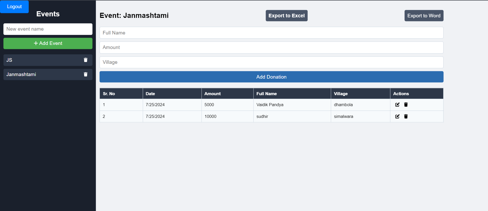

# Temple Fundraising Dashboard

## Overview

The Temple Fundraising Dashboard is a sophisticated fundraising management platform developed using the MERN stack (React, Node.js, Express.js, and MongoDB). This platform is designed to effectively manage fundraising events and donations, providing real-time updates and improved data handling efficiency. It supports over 20 events and 500 donations, offering comprehensive CRUD operations and enhanced reporting functionalities.

## Features

- **Event Management:** Create, update, delete, and view events seamlessly.
- **Donation Management:** Efficiently handle donations with real-time updates.
- **Export Functionalities:** Export donation and event data to Excel and Word for streamlined reporting.
- **Real-time Updates:** Ensure data is always up-to-date.
- **User-friendly Interface:** Intuitive and easy-to-use interface for managing events and donations.

## Tech Stack

- **Frontend:** React
- **Backend:** Node.js, Express.js
- **Database:** MongoDB

## Installation

**Clone the repository frontend:**

```bash
git clone https://github.com/vaidik24/templeFundFrontEnd.git
cd templeFundFrontEnd
npm install
npm run dev
```

## Screenshots



## Contributions

Contributions are welcome! Please open an issue or submit a pull request if you have any improvements or suggestions.

## Contact

### For any questions or inquiries, please contact:

[vaidik24pandya@gmail.com](vaidik24pandya@gmail.com)
